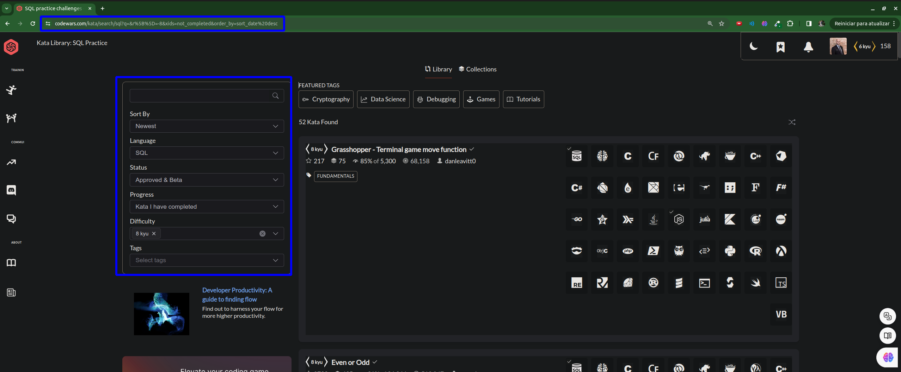

# Documenter Codewars Challenges

An easy way to document your Codewars challenges!

### Setup:
- `npm i`
- Create `.env` file based on `.env.example`

### Run: 
- `node .`

### Hint: How to get a list of challenges in Codewars?  

- **_Example_:** **Language:** _SQL_ | **Difficulty:** _8kyu_ | **Progress:** _Kata I have completed_ | Status: _Approved & Beta_

</img>

